# Samples

All sample images with their detection overlays, generated by running
`python3 detect_faces.py samples` from the repo root. Each colour is a
different detector; the bottom bar shows how many faces each one found for
that image.

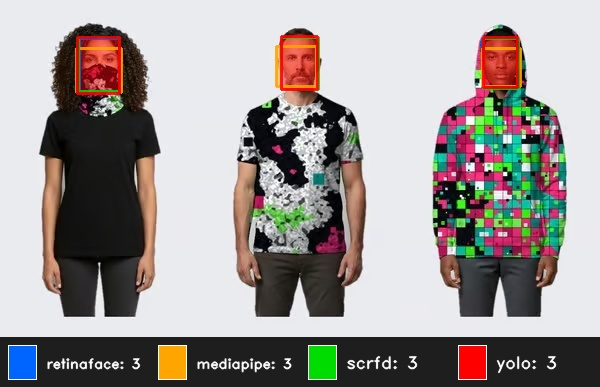

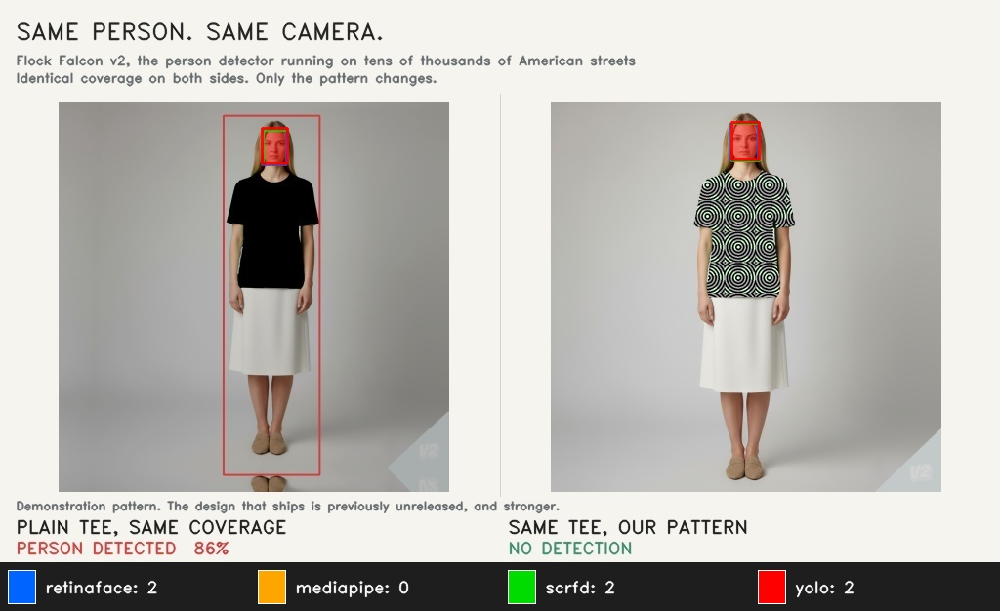

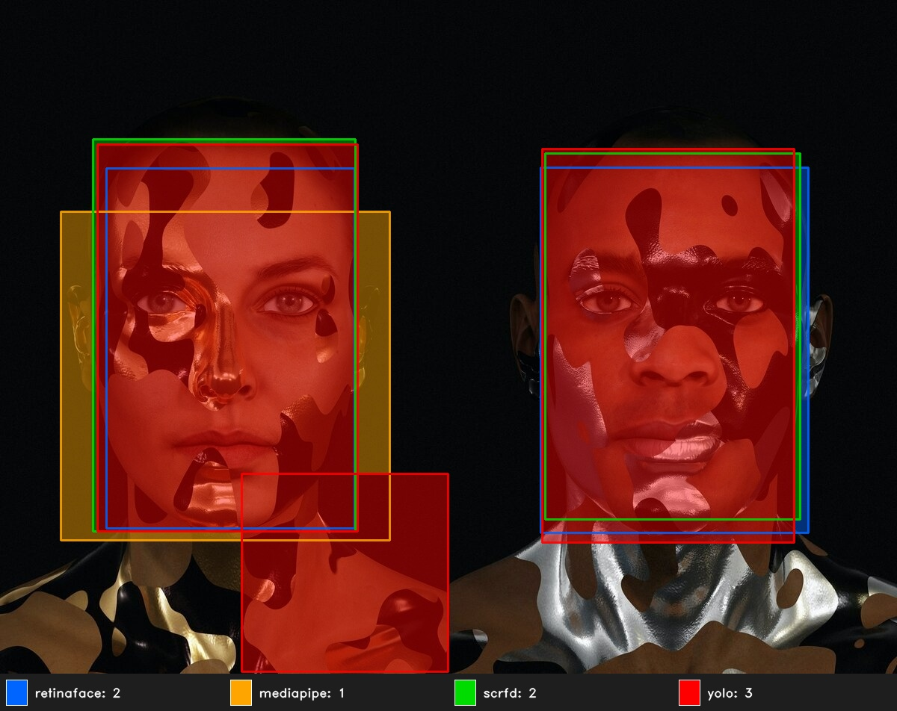

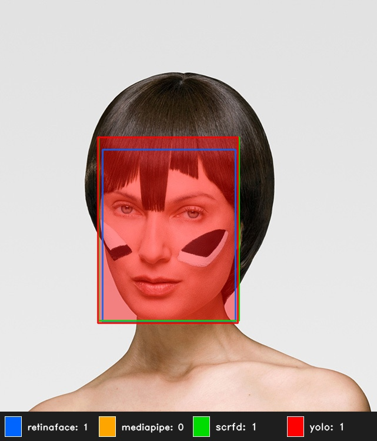

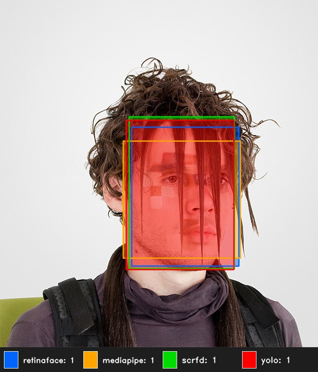

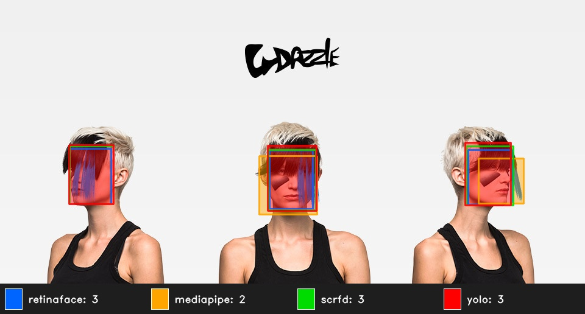

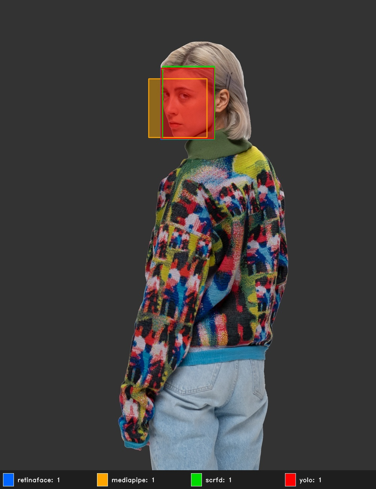

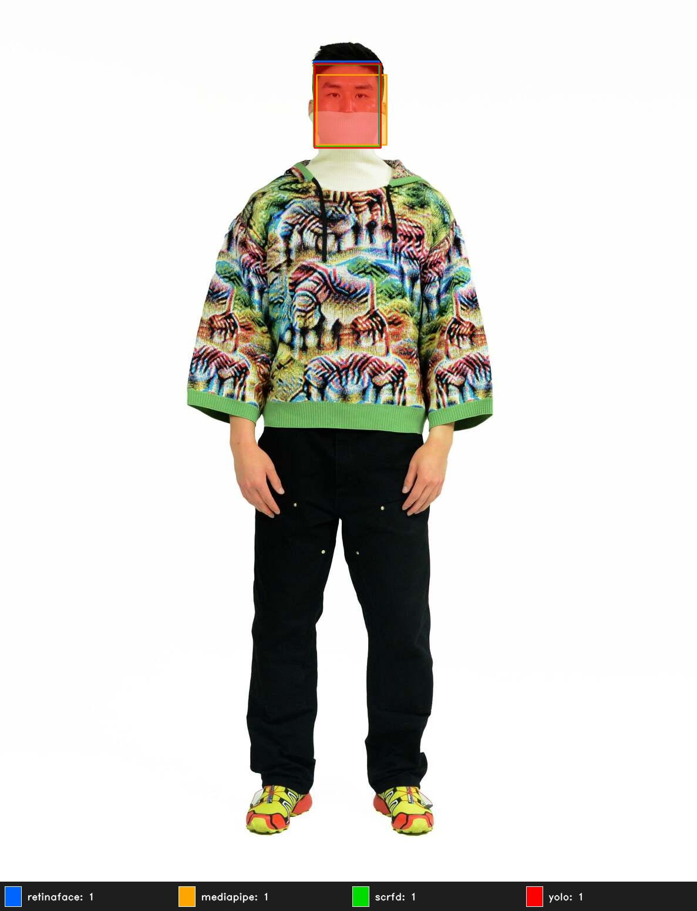

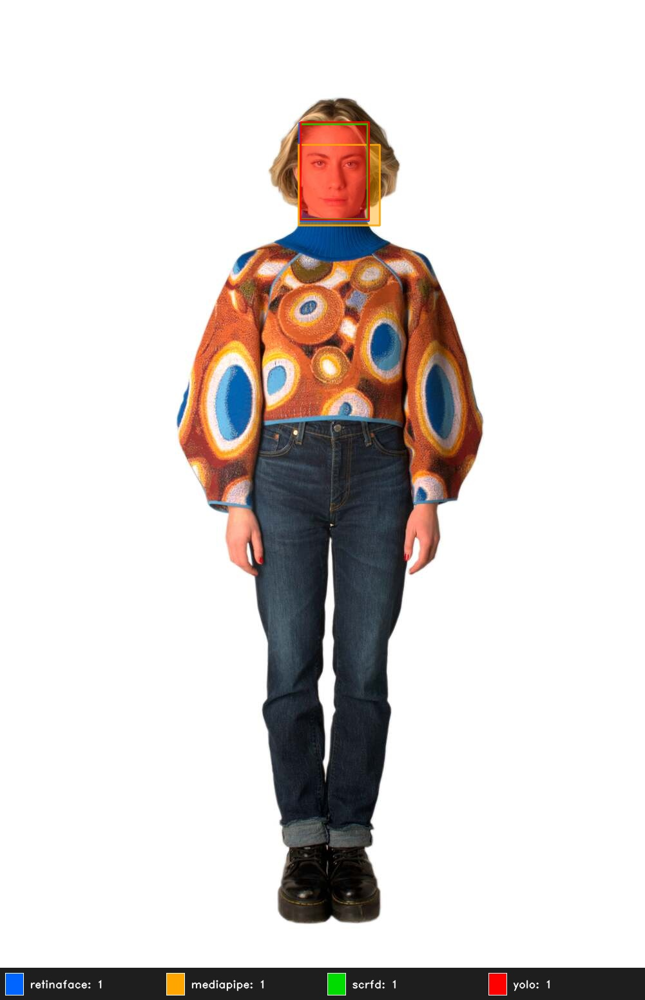

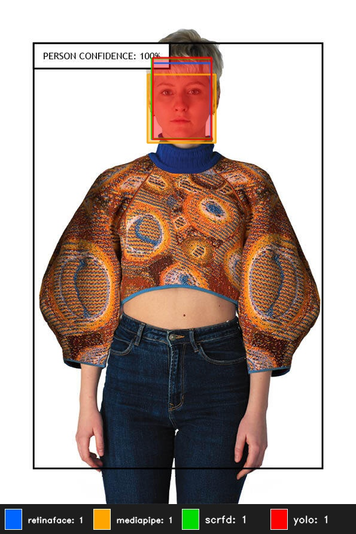

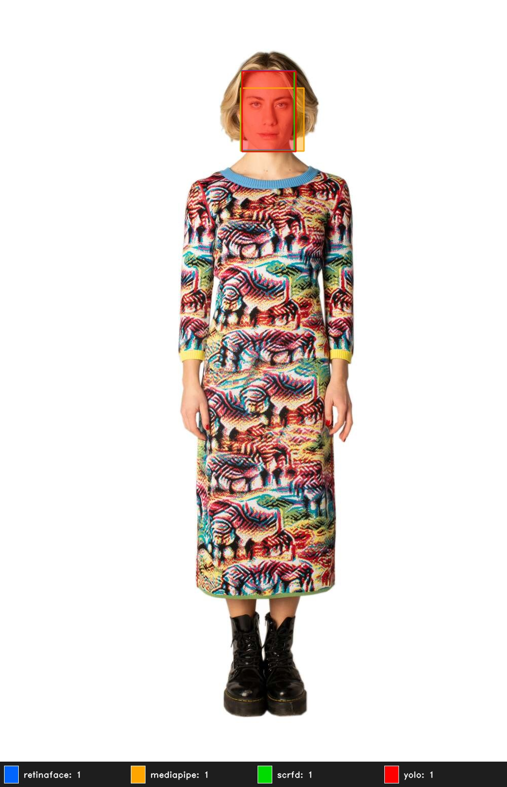
